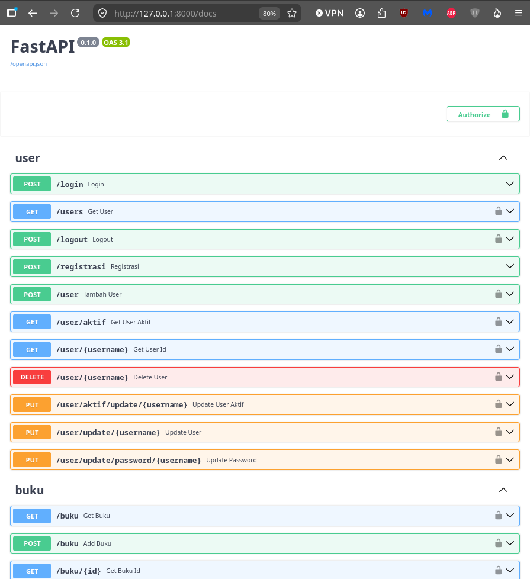
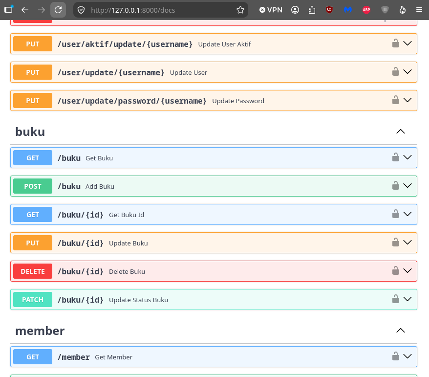
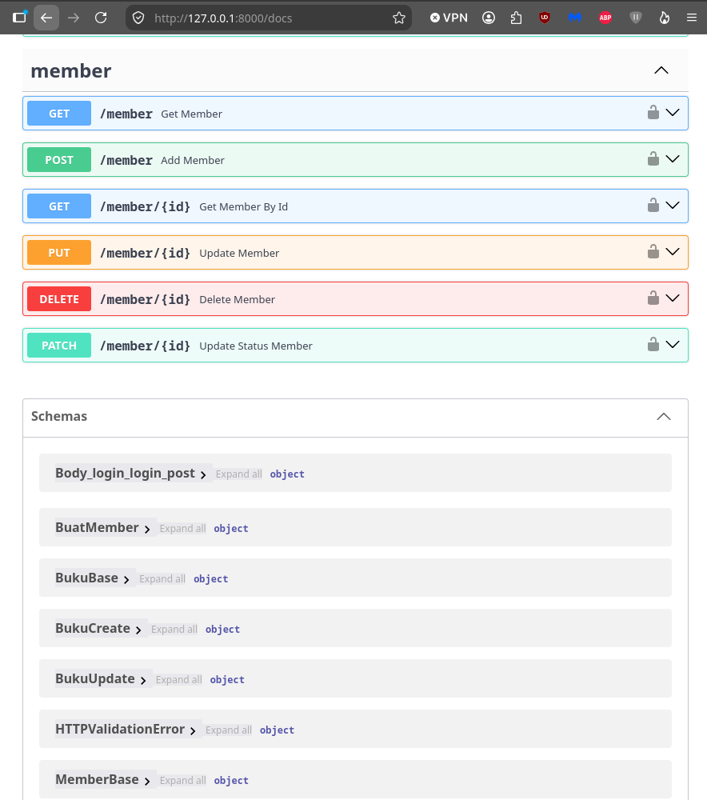

## Manajemen Buku API dengan OAuth2 + JWT

Endpoint Manajemen buku sederhana menggunakan FastAPI dengan JWT (Non-Database)

## Topik Sebelum Oauth2 ([link repo](https://github.com/dams-code/manajemen-buku-api))

- FastAPI
- Path / Query Parameters
- Pydantic BaseModel
- Request Body
- In-Memory Data (Python List)
- Filtering dan CRUD
- HTTPException
- jsonable_encoder
- JSONResponse
- Non-Database

## Topik Oauth Tanpa JWT ([link repo](https://github.com/dams-code/manajemen-buku-api-oauth2))

 - ✅ APIRouter
 - ✅ Layered Structure
 - ✅ OAuth2 (Non-JWT) (Login User dan Handle CRUD Data Buku)
 - ✅ Registrasi User
 - ✅ Edit Profile User
 - ✅ Ganti Password User
 - ✅ RBAC - Role Based Access
 - ✅ CRUD Buku (Admin saja, manajer hanya sebagai viewer)
 - ✅ CRUD Daftar User (Manajer Saja, jika admin mengeklik - akses ditolak dan di redirect ke 403.html)
 - ✅ Perbaikan Layout dan Membuat (CRUD User - yang dapat melakukan role manajer)

## Topik Oauth + JWT ([link repo](https://github.com/dams-code/manajemen-buku-api-oauth2-jwt))

 - ✅ Mengganti proses create_token, dan verify_token dari itsdangerous menjadi jwt
 - ✅ Perbaikan Kode repositories `user.py` dan `role.py`
 - ✅ Menambahkan BaseModel `TokenData` pada schemas / token

## Topik Oauth + JWT + Database (Postgres) (On-progress)

 - ✅ Migrasi data_buku dari list menjadi table database
 - ✅ Membuat model buku
 - ✅ Perbaikan schemas/buku pada BaseModel menyesuaikan model buku
 - ✅ konfigurasi alembic untuk migrasi model buku
 - ✅ Membuat `declarative_base` yang digunakan pada model buku agar SQLAlchemy dapat secara otomatis memasukan model buku kedalam Base.metadata dan didaftarkan sebagai table. (Alembic menyimpan log setiap perubahan pada Buku(Base))
 - ✅ Migrasi data_user dari list menjadi table database
 - ✅ Normalisasi pada data_user, role dipisah, membuat `relasi one-to-many` antara role dan user
 - ✅ Membuat seeder data untuk role
 - ✅ Perbaikan repositories user
 - ✅ Perbaikan schemas dan model user.
 - ✅ Perbaikan redirect 403 dan dependencies pada role user
 - ✅ Membuat Models member + migrasi models ke database, route, dan repositories / controller

- ⬜️ Membuat Model Peminjaman pada manajemen buku

### Perbedaan schemas/buku dari list dan sesudah migrasi ke database.
---

<table>
<tr>
<th width="50%"><b>Schemas/buku (List)</b></th>
<th width="50%"><b>Schemas/buku (Hasil Migrasi)</b></th>
</tr>
<tr>
<td valign="top">

```python
class BukuBase(BaseModel):
    id: int
    judul: str
    penulis: str
    tahun: int
    genre: str
    tersedia: bool

class Buku(BaseModel):
    judul: str
    penulis: str
    tahun: int
    genre: str
    tersedia: bool
    
class ResultBuku(BaseModel, Generic[T]):
    status: int
    pesan: str
    data: Optional[T] = None
```
</td>
<td valign="top">

```python
class BukuBase(BaseModel):
    id: int
    judul: str
    penulis: str
    tahun: int
    genre: str
    tersedia: bool = True
    qty: int | None = 0
    created_at: datetime
    created_by: str
    modify_at: datetime | None
    modify_by: str | None

    model_config = ConfigDict(from_attributes=True)

class BukuCreate(BaseModel):
    judul: str
    penulis: str
    tahun: int
    qty: int
    genre: str
    tersedia: bool = True
    qty: int | None = 0

class BukuUpdate(BaseModel):
    judul: str | None
    penulis: str | None
    tahun: int | None
    qty: int | None
    genre: str | None
    tersedia: bool | None
    qty: int | None

class ResultBuku(BaseModel, Generic[T]):
    status: int
    pesan: str
    data: Optional[T] = None
```
</td>
</tr>
</table>

### Model Buku

```python
class Buku(Base):
    __tablename__ = "buku"

    id: Mapped[int] = mapped_column(primary_key=True, index=True)
    judul: Mapped[str] = mapped_column(String(255), index=True, unique=True)
    penulis: Mapped[str] = mapped_column(String(255), index=True)
    tahun: Mapped[int] = mapped_column(Integer)
    genre: Mapped[str] = mapped_column(String(30))
    qty: Mapped[int] = mapped_column(Integer, default=0)
    tersedia: Mapped[bool] = mapped_column(Boolean, default=True)
    created_at: Mapped[DateTime] = mapped_column(DateTime, server_default=func.now())
    created_by: Mapped[str] = mapped_column(String(50))
    modify_at: Mapped[Optional[DateTime | None]] = mapped_column(DateTime, onupdate=func.now(), nullable=True)
    modify_by: Mapped[Optional[str | None]] = mapped_column(String(50), nullable=True)

```

### Perbedaan schemas/user dari list dan sesudah migrasi ke database.

<table>
<tr>
<th width="50%"><b>Schemas/user (List)</b></th>
<th width="50%"><b>Schemas/user (Hasil Migrasi)</b></th>
</tr>
<tr>
<td valign="top">

```python
class UserBase(BaseModel):
    username: str
    nama: str
    role: str
    
class User(UserBase):
    password: str
    
class UserInDB(UserBase):
    hash_password: str

class UserResponse(UserBase):
    id: int

class UserUpdate(BaseModel):
    id: int
    nama: Optional[str] = None
    role: Optional[str] = None 

class UpdatePasswordUser(BaseModel):
    passwordLama: str
    passwordBaru: str

class ResultUser(BaseModel, Generic[T]):
    status: int
    pesan: str
    data_user: Optional[T] = None
    data_token: Optional[TokenSession] = None
```
</td>
<td valign="top">

```python
class UserBase(BaseModel):
    username: str
    nama: str
    # role: str
    role_id: int
    created_at: datetime
    created_by: str
    modify_at: datetime | None
    modify_by: str | None

    model_config = ConfigDict(from_attributes=True)
    
class User(UserBase):
    password: str
    
class UserInDB(UserBase):
    hashed_password: str

class UserResponse(UserBase):
    id: int
    role_ref: RoleResponse

    model_config = ConfigDict(from_attributes=True)

class UserCreate(BaseModel):
    username: str
    nama: str
    # role: str
    password: str
    role_id: int

class UserUpdate(BaseModel):
    # id: int
    nama: Optional[str] = None
    # role: Optional[str] = None
    role_id: Optional[int] = None

class UpdatePasswordUser(BaseModel):
    passwordLama: str
    passwordBaru: str

class ResultUser(BaseModel, Generic[T]):
    status: int
    pesan: str
    data_user: Optional[T] = None
    data_token: Optional[TokenSession] = None
```
</td>
</tr>
</table>

### Model User dan Model Role

Pada model user dan role, saya set one-to-many, 1 role bisa di isi oleh banyak user, dari sisi user hanya dapat punya 1 role.

<table>
<tr>
<th width="50%"><b>models/user</b></th>
<th width="50%"><b>models/roles</b></th>
</tr>
<tr>
<td valign="top">

```python
class User(Base):
    __tablename__ = "users"

    id: Mapped[int] = mapped_column(primary_key=True, index=True)
    username: Mapped[str] = mapped_column(String(50), index=True, unique=True)
    nama: Mapped[str] = mapped_column(String(255))
    # role: Mapped[str] = mapped_column(String(10))
    hashed_password: Mapped[str] = mapped_column(String(255))
    created_at: Mapped[DateTime] = mapped_column(DateTime, server_default=func.now())
    created_by: Mapped[str] = mapped_column(String(50), default='system')
    modify_at: Mapped[Optional[DateTime]] = mapped_column(DateTime, onupdate=func.now(), nullable=True)
    modify_by: Mapped[Optional[str]] = mapped_column(String(50), nullable=True)
    
    role_id: Mapped[int] = mapped_column(ForeignKey("roles.id"))
    role_ref = relationship("Role", back_populates="user_ref", lazy="selectin")
```
</td>
<td valign="top">

```python
class Role(Base):
    __tablename__ = "roles"

    id: Mapped[int] = mapped_column(primary_key=True, index=True)
    roledesc: Mapped[str] = mapped_column(String(10))

    user_ref: Mapped[list["User"]] = relationship("User", back_populates="role_ref")
```
</td>
</tr>
</table>

### Konfigurasi Alembic (env.py)  [Kode](alembic/env.py)

```python
...

from core.database import DB_url, Base
from alembic import context

config = context.config

config.set_main_option("sqlalchemy.url", DB_url)

if config.config_file_name is not None:
    fileConfig(config.config_file_name)

# target_metadata = None
target_metadata = Base.metadata

def run_migrations(connection):
    context.configure(connection=connection, target_metadata=target_metadata)

    with context.begin_transaction():
        context.run_migrations()

async def run_async_migrations() -> None:
    connectable = async_engine_from_config(
        config.get_section(config.config_ini_section, {}),
        prefix='sqlalchemy.',
        poolclass=pool.NullPool,
    )

    async with connectable.connect() as connection:
        await connection.run_sync(run_migrations)

    await connectable.dispose()

def run_migrations_online() -> None:
    asyncio.run(run_async_migrations())

...

```

### Konfigurasi Database dan Session ([Kode](core/database.py))
---

```python
import os
from dotenv import load_dotenv
from sqlalchemy.ext.asyncio import create_async_engine, AsyncSession, async_sessionmaker
from sqlalchemy.orm import DeclarativeBase

load_dotenv()

DB_USER = os.getenv("USER_DB")
DB_PASSWORD = os.getenv("PASSWORD_DB")
DB_PORT = os.getenv("PORT_DB")
DB_NAME = os.getenv("DATABASE_DB")
DB_HOST = os.getenv("HOST_DB")

DB_url = f"postgresql+psycopg://{DB_USER}:{DB_PASSWORD}@{DB_HOST}:{DB_PORT}/{DB_NAME}"

engine = create_async_engine(DB_url, echo=True)

AsyncLocalSession = async_sessionmaker(
    bind=engine,
    class_=AsyncSession,
    expire_on_commit=False
)

class Base(DeclarativeBase):
    pass

async def get_database():
    async with AsyncLocalSession() as session:
        try:
            yield session
        finally:
            await session.close()

```


### Susunan file .env
---

```text
SECRET_KEY = '...'
USER_DB='...'
PASSWORD_DB='...'
PORT_DB=<Angka Port> (tanpa petik.)
DATABASE_DB='...'
HOST_DB='...'
```

## Cara Exekusi / menjalankan program

*) Install uv (jika belum ada) (install secara global)

```bash
pip install uv
```

1. Clone project

```bash
    git clone https://github.com/dams-code/manajemen-buku-api-oauth2-jwt-database.git
```

2. Masuk ke folder project

```bash
cd manajemen-buku-api-oauth2-jwt-database
```

3. Buat virtual environment

```bash
python -m venv <nama_virtual_environment>
```

4. Aktifkan virtual environment

 - `Linux`
```bash
source <nama_virtual_environment>/bin/activate
```

 - `Windows`
```bash
Scripts\activate
```

5. Install Library

```bash
pip install "fastapi[standard]" "pwdlib[argon2]" python-dotenv
```

```bash
pip install alembic SQLAlchemy pyjwt "psycopg[binary]" greenlet
```

6. migrasi model ke database dengan alembic

```bash
alembic upgrade head
```

7. Jalankan seeder (karena pada role ini saya set hanya ada admin dan manajer saja.)

```bash
python -m core.seed_data
```

8. Dokumentasi dan mount html

```bash
uv run fastapi dev
```

> **Link Dokumentasi**

```bash
http://127.0.0.1:8000/docs
```
> **Link Mount html**

```bash
http://127.0.0.1:8000/
```


### Dokumentasi
---

| <div style="padding:10px;"> |
| :---: |
| <div style="padding:10px;"> |
| <div style="padding:10px;"> |

<br/>


## Tech Stack

#### Backend


#### Frontend


## Copyright Personal Portfolio
* **Project Owner / Created By:** Damar Djati Wahyu Kemala
* **Study:** FastAPI endpoint CRUD buku sederhana versi ke 3 dengan OAuth2 + JWT
* **Date Created:** Agustus 2026
* **GitHub Portfolio:** [https://github.com/dams-code](https://github.com/dams-code)
